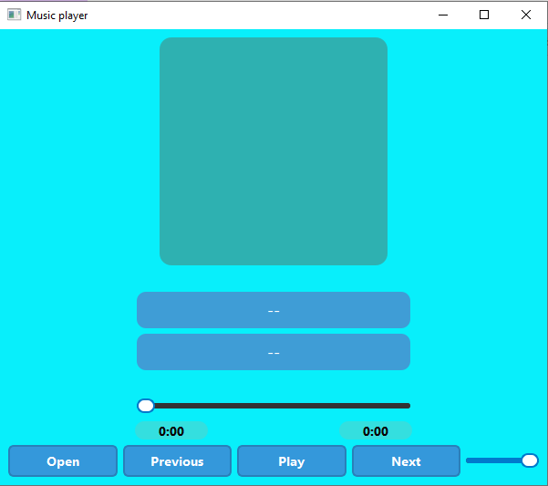

# 🎵 Music Player

A simple desktop music player built with **Python and PySide6**.

This is a beginner-friendly project created while learning GUI development with PySide6 and multimedia handling with Qt.

## 📸 Screenshot



## ✨ Features

- 🎵 Play audio files
- ⏯️ Play and pause music
- 🔊 Volume control
- 📊 Playback progress
- 🖼️ Album artwork support

## 🛠️ Built With

- **Python**
- **PySide6**
- **Qt Multimedia**
- **QSS**

## 🚀 Run From Source

### Requirements

- Python 3.x
- PySide6

Install PySide6:

```bash
pip install PySide6
```

Run the application:

```bash
python main.py
```

## 🪟 Windows

A ready-to-use Windows executable is available for Windows users.

### 📥 Download

**[Download Music Player for Windows](../../releases/latest)**

Download `MusicPlayer.exe` from the latest release and run it.

## 🔮 Future Plans

This project is still under development.

Possible future improvements:

- [ ] Playlist support
- [ ] Shuffle
- [ ] Repeat
- [ ] Better music library
- [ ] Improved album artwork
- [ ] Keyboard media controls
- [ ] More customization

## 📄 License

This project is licensed under the MIT License.

## 👨‍💻 Author

**Sahil**

A simple project built while learning Python and PySide6.
